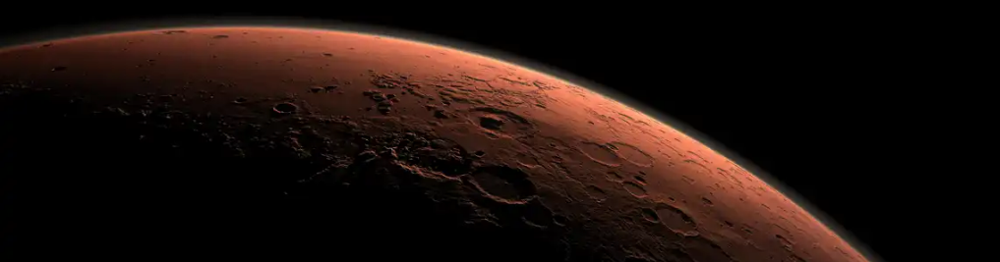

# Mission-to-Mars

## Overview of Project
- Automate a web browser to visit different websites to extract data about the Mission to Mars.
- Store the data in a NoSQL database 
- Render the data in a web application created with Flask. 